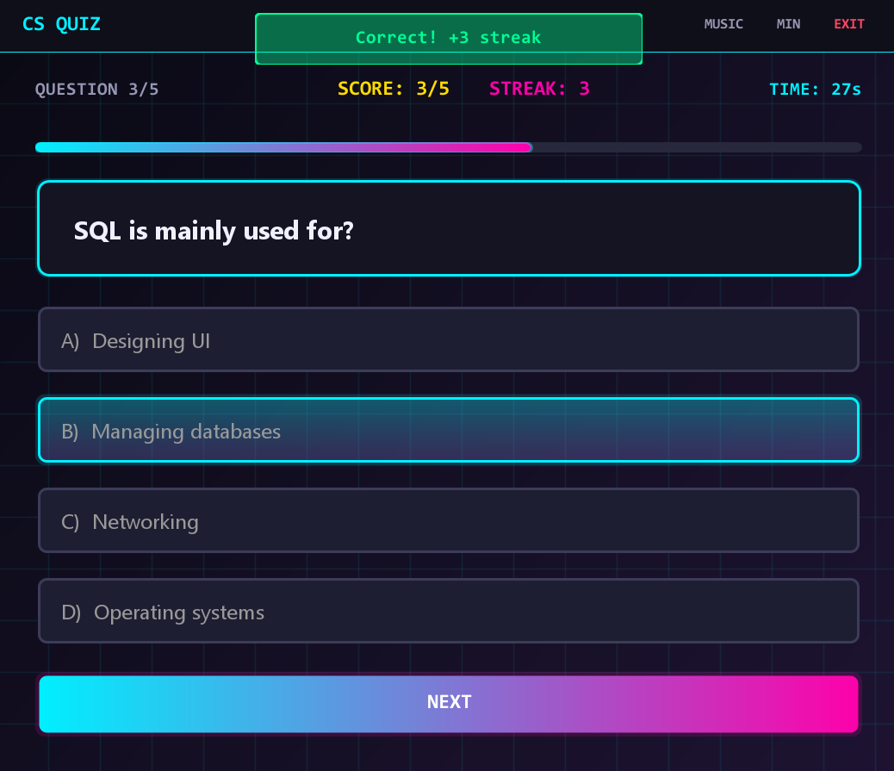
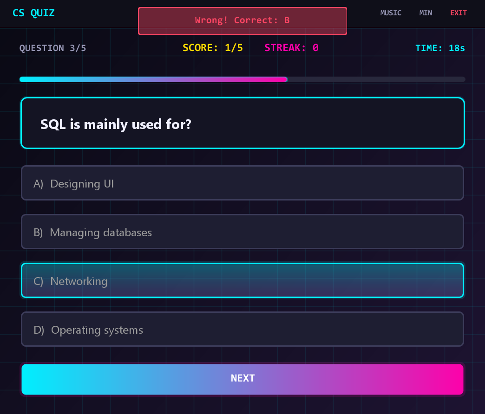

# CS Quiz - JAVA Mini Project

A modern, interactive Computer Science quiz application built entirely with Java Swing.


## ✨ Features

- **Cyberpunk UI Design** - Sleek, modern interface with neon gradients and glowing effects
- **Real-time Stats** - Live score tracking, streak counter, and progress bar
- **Countdown Timer** - 30-second timer per question with visual feedback
- **Sound Effects** - Audio feedback for correct/wrong answers
- **Background Music** - Optional background music with toggle control
- **Smooth Animations** - Visual feedback with color flashes and transitions
- **Custom Window** - Frameless design with custom title bar controls


## 🎮 Screenshots




## 🚀 Getting Started

### Prerequisites

- Java Development Kit (JDK) 8 or higher
- IDE (IntelliJ IDEA, Eclipse, or NetBeans recommended)

### Installation

1. Clone the repository
```bash
git clone https://github.com/AnissWD/cs-quiz.git
cd cs-quiz
```

2. Open the project in your IDE

3. Build and run the `Main.java` file

### Running the Application

```bash
javac com/aniss/csquiz/*.java
java com.aniss.csquiz.Main
```

Or simply run from your IDE.

## 🎨 Design

The application features a **Snatcher-inspired cyberpunk aesthetic** with:

- Deep navy/black backgrounds
- Gradient effects and glowing borders
- Custom-painted UI components
- Smooth animations and transitions
## 🎵 Sound Configuration

The app supports custom sound files. Place your audio files in:

```
src/sounds/
└── background.wav   # Background music (loops)
```

If sound files are not found, the app will generate programmatic beep sounds as fallback.

## 🛠️ Technologies Used

- **Java Swing** - UI framework
- **Graphics2D** - Custom rendering and animations
- **Java Sound API** - Audio playback
- **AWT** - Event handling and graphics

## 💡 Key Concepts Demonstrated

- Object-Oriented Programming (OOP)
- Model-View-Controller (MVC) pattern
- Event-driven programming
- Custom UI component painting
- Animation and timing
- Audio programming
- File I/O handling

## 🎯 How to Use

1. Launch the application
2. Read each question carefully
3. Select your answer (A, B, C, or D)
4. Click "NEXT" to submit
5. Build your streak by answering correctly!
6. Complete all questions to see your final score

### Controls

- **MUSIC** - Toggle background music on/off
- **MIN** - Minimize window
- **EXIT** - Close application
- **Drag title bar** - Move window

## 📊 Quiz Features

- Multiple choice questions
- Instant feedback on answers
- Streak counter (resets on wrong answer)
- Percentage calculation
- Performance grading system
- Auto-submit when timer expires

## 🔧 Customization

### Adding Questions

Edit the `Quiz.java` file to add your own questions:

```java
quiz.add(new Question(
    "Your question here?",
    "Answer A",
    "Answer B",
    "Answer C",
    "Answer D",
    'A'  // Correct Answer
));
```

### Changing Colors

Modify the color constants in `QuizUI.java`:

```java
private final Color ACCENT_CYAN = new Color(0, 180, 200);
private final Color ACCENT_MAGENTA = new Color(255, 80, 50);
// ... etc
```

### Timer Duration

Change the timer duration in the `startTimer()` method:

```java
timeRemaining = 30;  // Change to desired seconds
```

## 👤 Author

**Aniss**

- GitHub: [@AnissWD](https://github.com/AnissWD)
- LinkedIn: [Mohamed Aniss Hach](https://www.linkedin.com/in/mohamed-aniss-hach/)

## 🙏 Acknowledgments

- Built as a learning project to explore advanced Java Swing techniques

## 🤝 Contributing

Contributions, issues, and feature requests are welcome!

1. Fork the project
2. Create your feature branch (`git checkout -b feature/AmazingFeature`)
3. Commit your changes (`git commit -m 'Add some AmazingFeature'`)
4. Push to the branch (`git push origin feature/AmazingFeature`)
5. Open a Pull Request

## 📧 Contact

Have questions or suggestions? Feel free to reach out!

---

⭐ Star this repo if you found it helpful!
